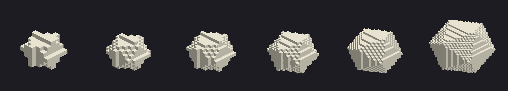

# Art Pipeline

> Status: draft v0.1 — 2026-08-08
> Researched August 2026.

## The thing to understand first

**AI image generators don't make voxel models.** They make 2D images, and a voxel game needs neither 2D images nor polygon meshes — it needs `.vox` files, which are 3D arrays of palette indices.

Two mismatches make the obvious approach fail:

1. **Resolution.** Nano Banana Pro outputs at 4K. Our block textures are **16×16 pixels**. Downsampling 4096px to 16px produces mud — the AI's detail is exactly what has to be thrown away, and what survives is noise. At 16px, every pixel is a deliberate decision. Hand-pixeling is genuinely faster than fixing a generated tile.

2. **Format.** Text-to-3D tools (Meshy, Tripo, Rodin) output *meshes*. Every output needs retopology, UV fixes, and material cleanup before it's engine-ready — their value is skipping the first 70% of blockout work for an artist who then polishes. We don't want a polished mesh. We want a 16×16×24 grid of colored cubes, which is a different kind of object entirely.

So: no engine change, no text-to-3D in the critical path. But Gemini has a real and valuable job here — just not the one you'd expect.

## The insight that actually matters

**Voxel assets are data, not images. Which means they're scriptable.**

A `.vox` file is a small 3D array. A chibi monster is roughly 16×16×24 voxels — about 6,000 cells, most of them empty. That is *small enough to be written by code*, and code is what agents are good at.

This flips the whole pipeline. Instead of "generate an image and convert it," the loop is:

1. Agent writes a Python script that emits a `.vox` file
2. Script renders a preview PNG
3. **Agent looks at the render** and fixes the script
4. Repeat until the silhouette reads

That's a tight, verifiable, fully-automatable loop with a real feedback signal — far better than prompting a diffusion model and hoping. It also gives us *parametric* monsters: one script with arguments produces the whole Zombie family, or twelve Killer Tomatoes at different scales.

Libraries: `py-vox-io` for reading/writing MagicaVoxel `.vox`, or write the format directly (it's simple). Godot imports `.vox` natively via `VoxelVoxLoader`.

## Where Gemini earns its keep

Nano Banana Pro (Gemini 3 Pro Image) is the premium tier — 4K output, strong world knowledge, good text rendering, strong brand/style consistency across a set. That maps onto four real jobs:

### 1. Concept art ⭐ highest value

**26 monsters need visual direction before anyone opens MagicaVoxel.** What silhouette is a Bog Gulper? How chibi is chibi? What does Doc M look like?

Generate front and side orthographic views on a plain background, chibi proportions, consistent style. Those become the reference sheet a modeler (human or scripted) builds from. This is the single highest-leverage use — it's cheap, fast, and it prevents 26 monsters drifting into 26 different art styles.

Nano Banana Pro's style consistency across a set is exactly the feature that matters here.

### 2. Marketing and store art

itch.io capsule, store page banners, trailer thumbnails, social posts. 4K output and reliable text rendering make it good at posters and capsules specifically. A fake 1950s drive-in poster for each monster group is *completely on-brand* and would be a genuinely great marketing angle.

### 3. UI art and icons

Item icons, frames, the photocopied-survival-pamphlet character sheet aesthetic, Doc M's intercom panel. UI runs at higher resolution than block textures, so the mismatch problem doesn't apply.

### 4. Texture *reference*, not texture output

Generate a materials moodboard — cracked concrete, rusted metal, sun-bleached siding, overgrown asphalt — and hand-pixel 16px tiles from it. The AI sets palette and mood; a human sets pixels.

## Where Gemini is not the answer

| Need | Use instead |
|---|---|
| Monster/prop `.vox` models | MagicaVoxel by hand, or scripted generation |
| 16px block textures | Hand-pixeled, from an AI moodboard |
| Animations | Godot's animation system on voxel rigs |
| Anything needing exact consistency at voxel scale | Scripts — deterministic, diffable, re-runnable |

## Tools

| Tool | Cost | Job |
|---|---|---|
| **Gemini / Nano Banana Pro** | Your paid plan | Concept art, marketing, UI, moodboards |
| **MagicaVoxel** | Free | The actual voxel modeling |
| `py-vox-io` + Python | Free | Scripted/parametric `.vox` generation |
| **Aseprite** | ~$20 | 16px textures. Worth it. |
| Godot `VoxelVoxLoader` | Free | Import |
| Meshy / Tripo / Rodin | Paid | ❌ Not for this project — mesh output, wrong format |

## Asset inventory

Roughly what M20: Voxel needs, so the scale is clear:

| Category | Count | Source |
|---|--:|---|
| Block textures (16px) | ~40 | Hand-pixeled |
| Character models (8 classes) | 8 | MagicaVoxel |
| Monster models | 26 | Scripted + hand polish |
| Weapons & items | ~30 | MagicaVoxel |
| Vehicles | 6 | MagicaVoxel — these are big, budget time |
| Building structures | 6 | Built in-engine as voxel prefabs |
| Dice | ~8 skins | Scripted — they're literally geometric solids |
| UI icons | ~60 | Gemini + cleanup |
| Marketing | ~15 | Gemini |

## ⚠️ Finding: the dice must be meshes, not voxels

*Tested 2026-08-08. `assets/scripts/gen_dice.py` generates a correctly voxelized icosahedron — 20 facets verified — at radii 3 through 14.*

*Left to right: radius 3, 4, 5, 6, 8, 12. The player character is ~3.5 blocks tall — so even the rightmost die is oversized, and it still doesn't read as a d20.*

**The result was negative, and it's worth knowing early.** At r=3–5 the die is a lumpy blob. Even at r=12 (27³ voxels, larger than the player) it reads as a *chunky faceted rock*, not a twenty-sided die. Voxelization destroys the two things that identify a d20:

1. **Crisp triangular edges.** Stair-stepping rounds the silhouette; the facets stop reading as triangles.
2. **A readable number on the up-face.** Impossible at any voxel resolution we'd ship.

That second one is fatal. The entire feature is *"you see the die land on 20."* A die you can't read a number off of isn't a die.

**Decision: the dice are a real low-poly mesh with UV-mapped numerals.** An icosahedron is 20 triangles — trivially cheap even at the 40-concurrent cap, crisp at any distance, and it can carry legible numbers. Mixing a non-voxel hero object into a voxel world is completely normal (Minecraft does it for items).

Skins stay cheap: material and texture swaps on one shared mesh.

The scripted `.vox` pipeline is still correct for **monsters, props, and characters** — it just isn't right for the one object whose identity depends on sharp edges and text. `gen_dice.py` stays in the repo as the experiment that settled it.

**Vehicles are the real time sink.** Six of them, each needing to read clearly as a pickup/bus/motorcycle at chibi scale. Budget accordingly, or cut to three for v1.

## The `daedalus` agent

New agent, owns `assets/`. See `.claude/agents/art.md`. It writes generation scripts, manages the concept-art library, and maintains the palette — it does **not** touch engine code.

Critical capability: it must be able to **render and look**. A voxel model script that can't be visually verified is a script writing garbage confidently.

## Style bible — do this early

Before generating 26 monsters, lock:

- **Palette.** One shared palette file across every `.vox` asset. This is what makes a mixed roster look like one game. Non-negotiable.
- **Scale.** Player = 2 blocks wide, ~3.5 tall. Every monster relative to that.
- **Silhouette rule.** Every monster must be identifiable in pure black at 40 blocks. Test it: render the silhouette, show it to someone, ask what it is.
- **Detail budget.** Roughly 16×16×24 for humanoids. Resist detail — it disappears at play distance and costs draw calls.

Write it as `assets/STYLE.md` with the palette committed alongside. Every agent and every generation prompt references it.
